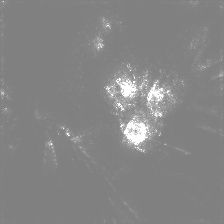

# SmoothGrad implementation in PyTorch

PyTorch implementation of [SmoothGrad: removing noise by adding noise](https://arxiv.org/abs/1706.03825).

|Vanilla Gradients|SmoothGrad|Guided backpropagation|Guided SmoothGrad|
|:-:|:-:|:-:|:-:|:-:|
|||||

And other techniques such as the following are implemented.

+ [Vanilla Gradients](https://arxiv.org/abs/1312.6034)
+ [Guided backpropagation](https://arxiv.org/abs/1412.6806)
+ [Grad-CAM](https://arxiv.org/abs/1610.02391)

## Download
```
git clone https://github.com/pkdn/pytorch-smoothgrad
```

## Usage

Save the saliency maps using `VanillaGrad`, `GuidedBackpropGrad`, `SmoothGrad`, `GuidedBackpropSmoothGrad`.

```
python saliency.py --img <image-path>
```

Save the Grad-CAM image.

```
python grad_cam.py --img <image-path>
```

If you do not specify an image path, read the raccoon's data ([scipy.misc.face()](https://docs.scipy.org/doc/scipy-0.18.1/reference/generated/scipy.misc.face.htmlM)).

## Requirements

+ PyTorch
+ torch-vision
+ numpy
+ scipy
+ OpenCV

Environment under Python 3.5.2 is tested.

## Acknowledgments

This code is insipired by [pytorch-grad-cam](https://github.com/jacobgil/pytorch-grad-cam).
